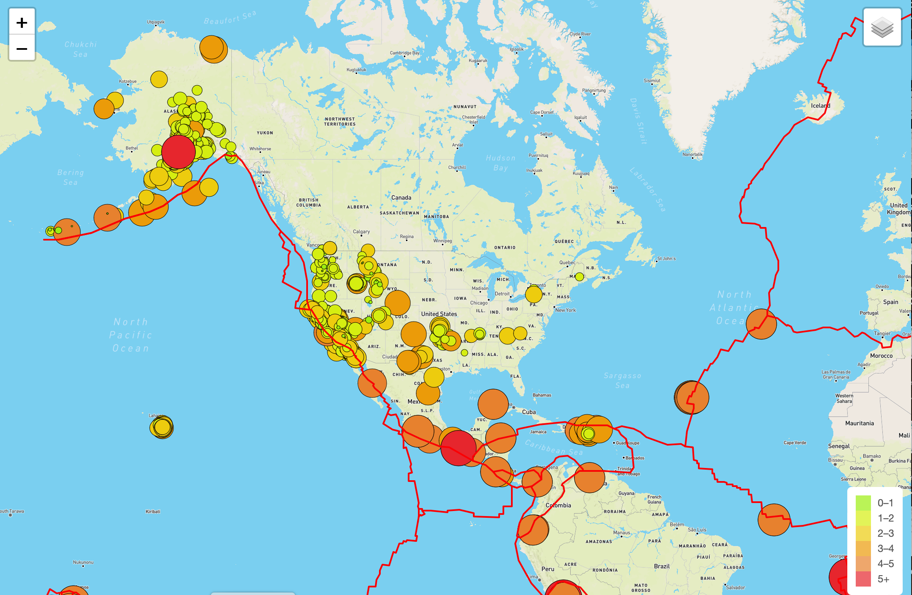

# Mapping Earthquakes

The purpose of this project is to visually show the differences between the magnitudes of earthquakes all over the world for the last seven days.

I have accessed GeoJSON data from the USGS website - https://earthquake.usgs.gov/ and retrieved geographical coordinates and the magnitudes of earthquakes for the last seven days, then mapped this information.

I have used the JavaScript and the D3.js library to retrieve the coordinates and magnitudes of the earthquakes from the GeoJSON data. 
Through the use of Leaflet library, I had plot the data on a Mapbox map through an API request and created interactivity for the earthquake data in multiple layers.